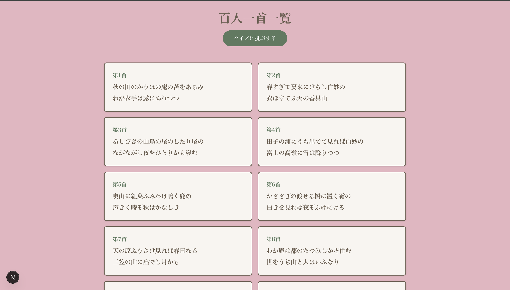

# 百人一首一覧＆クイズアプリ

百人一首の全歌を確認できる一覧機能と、クイズを実装しました。5問4択で、最後に結果発表、答え合わせが可能です。
学校で習った時の勉強用を想定して作成しました。今回は最低限の機能のみ実装したので、訳文などは今後追加実装予定です。

## 画面サンプル

①　トップ画面



②　クイズ画面->結果発表画面


<video src="https://github.com/user-attachments/assets/35ccae22-e004-4f8c-9b05-b879b1c1e253" loop muted autoplay playsinline width="100%"></video>

## 🚀 主な機能

- **百人一首一覧**: 第 1 首〜第 100 首までの和歌をカード形式で閲覧可能。
- **4 択クイズ**:
  - ランダムに 5 問出題。
  - 「上の句 → 下の句を当てる」と「下の句 → 上の句を当てる」の 2 形式。
  - 終了後に正解数と答え合わせを確認可能。
- **レスポンシブ対応**: 767px以下では和歌が一列に閲覧可能です。

## 🛠 使用技術

- **Framework**: Next.js (App Router)　v16.2.6
- **CSS**: Tailwind CSS v4
- **Language**: TypeScript
- **Icons/Fonts**: Sawarabi Mincho (Google Fonts)

## 🎨 デザインカラー

和風色を意識して選びました。

- 背景色: `#E6B5C1` (桜色)
- テキスト・枠線: `#6b5d4f` (媚茶)
- アクセント: `#5B7A5E` (千歳緑)
- カード背景: `#F8F5F0` (鳥の子色)

## 📦 セットアップ・起動方法

1. リポジトリをクローン

```bash
git clone [リポジトリURL]
```

2. 依存関係のインストール

```bash
npm install
```

3. 開発サーバーの起動

```bash
npm run dev
```

ブラウザで [http://localhost:3000](http://localhost:3000) を開くとアプリが表示されます。
